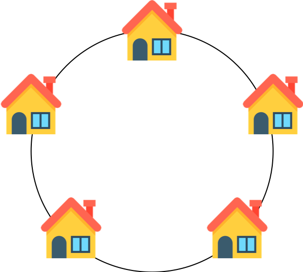

## DP 도둑질
## 문제 설명

도둑이 어느 마을을 털 계획을 하고 있습니다. 이 마을의 모든 집들은 아래 그림과 같이 동그랗게 배치되어 있습니다.

  

각 집들은 서로 인접한 집들과 방범장치가 연결되어 있기 때문에 인접한 두 집을 털면 경보가 울립니다.

각 집에 있는 돈이 담긴 배열 money가 주어질 때, 도둑이 훔칠 수 있는 돈의 최댓값을 return 하도록 solution 함수를 작성하세요.

제한사항  
이 마을에 있는 집은 3개 이상 1,000,000개 이하입니다.
money 배열의 각 원소는 0 이상 1,000 이하인 정수입니다.

입출력 예  

|money	|return|
|-------|------|
|[1, 2, 3, 1]|	4|

## 문제 풀이
- 집들을 차례로 정렬시켰을 때, 돈을 훔칠 집을 고르면 현재 집을 고르면 다음집을 못고르고,
  한 칸 씩 띄어서 집을 선택 할 수 있다.
- 현재 집을 기준으로 이 집을 선택했을 때와 안 선택했을 떄로 나누어서 두 가지 경우에 대한 최대 money를 구한다.
  (2차원 배열)
- 마지막 집과 첫번째 집은 연결되어 있다고 가정해야한다.
- 첫번째 집은 고정값으로 선택하지 않은 경우와 선택한 경우에 따라 나누어 dp값을 구한다.
- 첫번째 집을 선택하지 않은 경우에 대해서는 마지막집을 선택하거나 안하거나 둘 다 가능하므로 둘 중 최댓값을 선택한다.
- 첫번째 집을 선택한 경우는 마지막 집을 선택할 수 없으므로 마지막집을 선택하지 않은 경우만 가능하다.
- 이 두 값 중 최댓값이 도둑이 훔칠 수 있는 가장 큰 돈이다.
